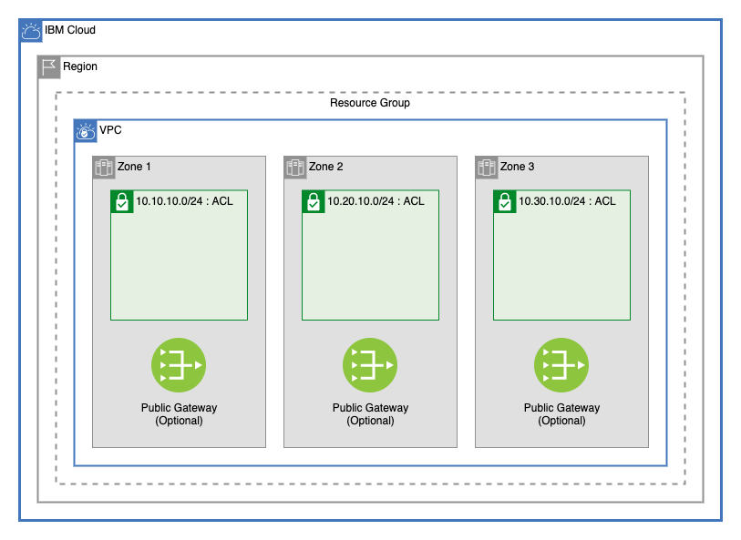

# Easy Multizone VPC

This template allows users to easily create a VPC with one subnet in each of three zones with very few inputs needed by the user to quikly start testing on IBM Cloud. 

## Default Configuration

The defaults of this module can be [overridden](#overriding-variables) with JSON to allow for a fully cusomizable VPC environment.

## Table of Contents

1. [Module Variables](#module-variables)
1. [VPC and Subnets](#vpc-and-subnets)
2. [Network ACL](#nettwork-access-control-list)
3. [Public Gateways](#public-gateways)
4. [Overriding Variables](#overriding-variables)

## Module Variables

Name                    | Type         | Description                                                                                                                               | Sensitive | Default
----------------------- | ------------ | ----------------------------------------------------------------------------------------------------------------------------------------- | --------- | ---------------------------
TF_VERSION              | string       | The version of the Terraform engine that's used in the Schematics workspace.                                                              |           | 1.0
ibmcloud_api_key        | string       | The IBM Cloud platform API key needed to deploy IAM enabled resources.                                                                    | true      | 
prefix                  | string       | A unique identifier for resources. Must begin with a letter. This prefix will be prepended to any resources provisioned by this template. |           | ez-multizone
region                  | string       | Region where VPC will be created. To find your VPC region, use `ibmcloud is regions` command to find available regions.                   |           | us-south
resource_group          | string       | Name of existing resource group where all infrastructure will be provisioned                                                              |           | asset-development
tags                    | list(string) | List of tags to apply to resources created by this module.                                                                                |           | ["ez-vpc", "multizone-vpc"]
use_public_gateways     | bool         | Add a public gateway in each zone.                                                                                                        |           | true
add_cluster_acl_rules   | bool         | Add all needed rules to allow an IBM managed cluster to work on your VPC subnes.                                                          |           | false
allow_inbound_traffic   | bool         | Add a rule to the ACL to allow for inbound traffic from any IP address.                                                                   |           | true
classic_access          | bool         | Add the ability to access classic infrastructure from your VPC.                                                                           |           | false
override_json           | string       | Override any values with JSON to create a completely custom network. All quotation marks must be correctly escaped.                       |           | "{}"

## VPC and Subnets

### VPC

This module creates a single VPC in one IBM Cloud Region. The VPC can optionally be given access to Classic Infrastructure resources using the `classic_access` variable.

### Subnets

This module creates three subnets, one in each of the three zones:

Zone | Subnet CIDR
-----|-------------
1    | 10.10.10.0/24
2    | 10.20.10.0/24
3    | 10.30.10.0/24

---

## Network Access Control List

A single network ACL is created within the VPC and each of the three subnets are attached

### Network Access Control Rules

The following network rules are automatically created:

Source        | Destination   | Direction  | Allow / Deny
--------------|---------------|------------|--------------
10.10.10.0/24 | Any           | Inbound    | Allow
10.20.10.0/24 | Any           | Inbound    | Allow
10.30.10.0/24 | Any           | Inbound    | Allow
Any           | 10.10.10.0/24 | Outbound   | Allow
Any           | 10.20.10.0/24 | Outbound   | Allow
Any           | 10.30.10.0/24 | Outbound   | Allow
Any           | Any           | Outbound   | Allow

### Additional Access Control Rules

- To dynamically create allow rules to allow IBM Managed Clusters, set the `add_cluster_acl_rules` variable to `true`.
- To create a rule to allow all inbound traffic to your VPC, set the `allow_inbound_traffic` variable to `true`.

---

## Public Gateways

Optionally, a public gateway can be added to each of the three subnets by setting the `use_public_gateways` variable to `true`.

---

## Overriding Variables

This template uses the [vpc module](./vpc) to create the network architecture. A complete custom network architecture can be created from this template by passing stringified `json` data into the `override_json` variable. For an example of a valid JSON file, see [override-json.json](./override-json.json)